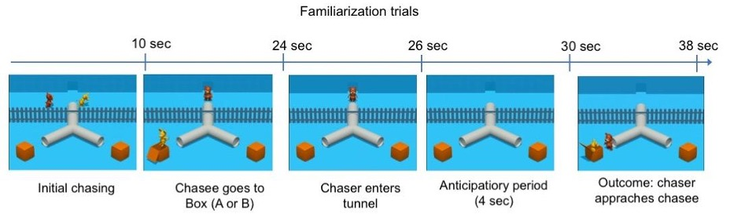
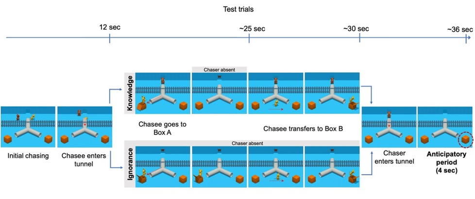
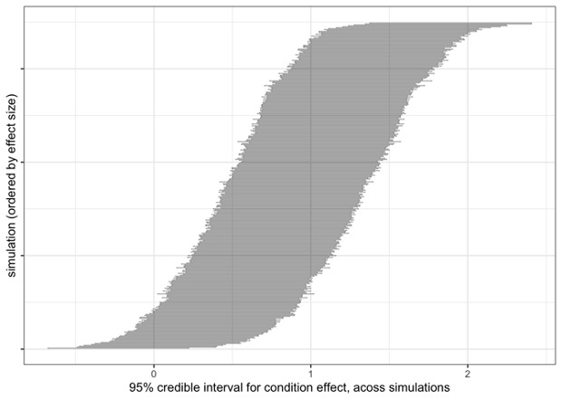
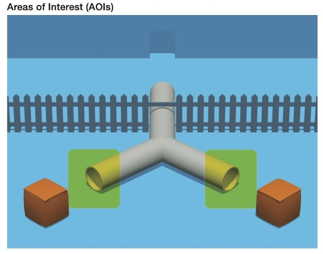

```{r load_packages_settings, include = FALSE}
library("papaja")
library(ggthemes)
library(tidyverse)
library(here)
library(knitr)
#library(kableExtra)

```

```{r load_authors}
# downloaded from https://docs.google.com/spreadsheets/d/1--ToAecjii3W2PtXuE_ZXkMw_u4MgFo-6G50b6hFQUw/edit#gid=1763252679 on ?

```

The capacity to represent epistemic states, known as Theory of Mind (ToM) or mentalizing, plays a central role in human cognition [@premack1978does; @frith2006neural; @dennett1989intentional]. Although ToM has been under intense scrutiny in the past decades, its nature and ontogeny are still the subjects of much controversy. At the heart of these debates are questions about the reliability of the tools used to measure ToM [e.g., @poulin2018infants; @baillargeon2018invited], among others, anticipatory looking (AL) paradigms. To address this issue, in a collaborative long-term project we assess the robustness of infants’ and adults’ tendency to spontaneously take into account different kinds of epistemic states  — what they perceive, know, think, or believe — when predicting others’ behaviors. This paper reports the first foundational step of this project, which focuses on the most basic epistemic state ascription: the capacity to distinguish between knowledgeable and ignorant individuals. Simple forms of knowledge attribution (such as tracking what other individuals have seen or experienced) are typically assumed to develop early and to operate spontaneously throughout the lifespan [e.g., @luo200712; @liszkowski2007pointing; @o1996two; @phillips2021knowledge]. Thus, evaluating whether ToM measures are sensitive to the knowledge-ignorance distinction is a crucial test case to assess their robustness. The present paper investigates this question in an AL paradigm including 18-27-month-old infants and adults.

In the following sections we first establish the background and scientific context of this study, namely the reliability and replicability of spontaneous ToM measures. We then introduce a novel way to approach these issues: a large-scale collaborative project targeting the replicability of ToM findings. Finally, we outline the rationale of the present study which uses an AL paradigm to test whether infants and adults distinguish between two basic forms of an agent’s epistemic state: knowledge and ignorance.

## Spontaneous Theory of Mind tasks

Humans are proficient at interpreting and predicting others’ intentional actions. Adults as well as infants expect agents to act persistently towards the goal they pursue [@csibra2007obsessed; @gergely2003teleological; @gergely1995taking, @woodward2000twelve], and anticipate others’ actions based on their goals even before goals are achieved - that is, humans engage in goal-based action anticipation [for review, see @elsner2021infants; but see @ganglmayer2019infants]. To predict others’ actions, however, it is essential to consider their epistemic state: what they perceive, know, or believe. A number of seminal studies using non-verbal spontaneous measures have suggested that infants, toddlers, older children, and adults show action anticipation and action understanding not only based on other agents’ goals (what they want) but also on the basis of their epistemic status (what they perceive, know, or believe). These studies suggest that from infancy onwards, humans spontaneously engage in ToM or mentalizing. For example, studies using violation of expectation methods have demonstrated that infants look longer in response to events in which an agent acts in ways that are incompatible with their (true or false) beliefs, compared to events in which they act in belief-congruent ways [@onishi200515; @surian2007attribution; @trauble2010early]. Other studies have employed more interactive tasks requiring the child to play, communicate, or cooperate with experimenters and, for example, give an experimenter one of several objects as a function of their epistemic status. Such studies have shown that toddlers spontaneously adjust their behavior to the experimenter’s beliefs [@buttelmann2009eighteen; @kiraly2018retrospective; @knudsen201218; @southgate2010motor].

The largest body of evidence for spontaneous ToM comes from studies using AL tasks. In such tasks, participants see an agent who acts in pursuit of some goal (typically, to collect a certain object) and has either a true or a false belief (for example, regarding the location of the target object). A number of studies have shown that infants, toddlers, older children, neurotypical adults, and even non-human primates anticipate (indicated by looks to the location in question) that an agent will go where it (truly or falsely) believes the object to be rather than, irrespective of the actual location of the object [@gliga2014early; @grosse2017implicit; @hayashi2020macaques; @kano2019great; @krupenye2016great; @meristo2012belief; @schneider2012cognitive; @schneider2013temporally; @senju2009mindblind; @senju2010absence; @senju201118; @surian2020domain; @thoermer2012continuity]. These studies have revealed converging evidence for spontaneous ToM across the human lifespan and even in other primate species.

Across the different measures, the majority of early works on spontaneous ToM in infants and toddlers have reported positive results in the second year of life, and a few studies even within the first year [@kovacs2010social; @luo2010toward; @southgate2014belief], yielding a rich body of coherent and convergent evidence [for reviews see e.g., @barone2019infants; @kampis2020altercentric; @scott2017early]. This growing body of literature has led to a theoretical transformation of the field. In particular, findings with young infants have paved the way for novel accounts of the development and cognitive foundations of ToM. The previous consensus was that full-fledged ToM emerges only at around age 4, potentially as the result of developing executive functions, complex language skills and other factors [e.g., @perner1991understanding; @wellman2001theory]. In contrast, the newer accounts proposed that some basic forms of ToM may be phylogenetically more ancient and may develop much earlier in ontogeny [e.g., @baillargeon2010false; @carruthers2013mindreading; @kovacs2016belief; @leslie2005developmental].

Recently, however, a number of studies have raised uncertainty regarding the empirical foundations of the early-emergence theories, as we review below. In the following sections, we present an overview of the current empirical picture of early understanding of epistemic states and then introduce ManyBabies2 (MB2), a large-scale collaborative project exploring the replicability of ToM in infancy, of which the current study constitutes the first step.


## Replicability of Spontaneous Theory of Mind Tasks

A number of failures to replicate findings from spontaneous ToM tasks have recently been published with infants, toddlers, and adults [e.g., @burnside2018implicit; @dorrenberg2018not; @grosse2017implicit; @wiesmann2018longitudinal; @kampis2021two; @kulke2018implicit; @kulke2019can; Kulke & Rakoczy, 2017 (symposium), @kulke2018implicitdata, @kulke2019testing; @kulke2018robust; @kulke2019implicit; @kulke2021implicit; @powell2018replications; @priewasser2018helping; @priewasser2020mistaken; @schuwerk2018robustness; for overviews, see @barone2019infants; @kulke2018implicitdata]. Besides conceptual replications, many of these studies involve more direct replication attempts with the original stimuli and procedures. One of these was a two-lab replication attempt of one of the most influential AL studies [@southgate2007action]. This failure to replicate is especially notable not only because of the influence of the original finding of the field, but also because of the large sample size and the involvement of some of the original authors [@kampis2021two]. Additional unpublished replication failures have also been reported. @kulke2018implicitdata examined 65 published and non-published studies including 36 AL studies [replications of @schneider2012eye; @southgate2007action; Surian & Geraci, 2012; and Low & Watts, 2013], as well as studies using other paradigms, and classified them as a successful, partial, or non-replication, depending on whether all, some, or none of the original main effects were found. Although no formal analysis of effect size was carried out, overall, non-replications and partial replications outnumbered successful replications, regardless of the method used.
In addition to the failure to replicate spontaneous anticipation of agents’ behaviors based on their beliefs, many of the replication studies revealed an even more fundamental problem of spontaneous AL procedures:  a failure to adequately anticipate an agent’s action in the absence of a belief. That is, researchers did not find evidence for spontaneous anticipation of agents’ behaviors based on their goals, even in the initial familiarization trials of the experiments, where the agent’s beliefs do not play any role yet (e.g., Kampis et al., 2020; Kulke, Reiß, et al., 2018; Schuwerk et al., 2018). The familiarization trials are designed to convey the goal of the agent, as well as the general timing and structure of events, to set up participants’ expectations in the test trials where the agent’s epistemic state is then manipulated. Typically, the last familiarization trial can also be used to probe participants’ spontaneous action anticipation; and test trials can only be meaningfully interpreted if there is evidence of above-chance anticipation in the familiarization trials. In several AL studies many participants had to be excluded from the main analyses for failing to demonstrate robust action anticipation during the familiarization trials (e.g., Kampis et al., 2020; Kulke, Reiß, et al., 2018; Schuwerk et al., 2018; Southgate et al., 2007). This raises the possibility that these paradigms may not be suitable for reliably eliciting spontaneous action prediction in the first place (for discussion see Baillargeon et al., 2018). 
In sum, in light of the complex and mixed state of the evidence, it currently remains unclear whether infants, toddlers, and adults engage in spontaneous ToM. This calls for systematic, large-scale, a priori designed multi-lab study that stringently tests for the robustness, reliability, and replicability of spontaneous measures of ToM.


## General Rationale of MB2

To this end, ManyBabies 2 (MB2) was established as an international consortium dedicated to investigating infants’ and toddlers’ ToM skills. The main aim is to test the replicability and thus reliability of findings from spontaneous ToM tasks. In the long-term, MB2 will build on the initial findings and the aim will be extended to include testing the validity of these experimental designs and addressing theoretical accounts of spontaneous ToM. MB2 operates under the general umbrella of ManyBabies (MB), a large-scale international research consortium founded with the aim of probing the reliability of central findings from infancy research. In particular, MB projects bring together large and theoretically diverse groups of researchers to tackle pressing questions of infant cognitive development, by collaboratively designing and implementing methodologies and pre-registered analysis plans [@frank2017collaborative]. The MB2 consortium involves authors of original studies as well as authors of both successful and failed replication studies, and researchers from very different theoretical backgrounds. It thus presents a case of true “adversarial collaboration” (Mellers et al., 2001).

## Rationale of the Present Study

Based on both theoretical and practical considerations, the current paper presents the first foundational step in MB2, focusing on AL measures. It investigates whether toddlers and adults anticipate (in their looking behavior) how other agents will act based on their goals (i.e., what they want) and epistemic status (i.e., what they know or do not know). From a practical perspective, we focus on AL since it is a child-friendly and widely used method that is also suitable for humans across the lifespan and even other species. Additionally, as AL is screen-based and standardizable, identical stimuli can be presented in different labs. From a theoretical perspective, given the mixed findings with AL tasks reviewed in the previous section, we take a systematic and bottom-up approach. 
First, we probe whether AL measures are suitable for measuring spontaneous goal-directed action anticipation. With the aim to improve the low overall rates of anticipatory looks in recent studies, we designed new, engaging stimuli to test whether these are successful in eliciting spontaneous action anticipation. Second, in case reliably elicited action anticipation can be found: we probe whether toddlers and adults take into account the agent’s epistemic status in their spontaneous goal-based action anticipation. That is, do they track whether the agent saw or did not see a crucial event, and therefore whether this agent does or does not know something? In the current study we focus on the most basic form of tracking the epistemic status of agents: considering whether they had access to relevant information, and whether they are thus *knowledgeable* or *ignorant*. We reasoned that only after establishing whether a context can elicit spontaneous tracking of an agent’s epistemic status in a more basic sense (i.e., the agent’s knowledge vs. ignorance) is it eventually meaningful to ask whether this context also elicits more complex epistemic state tracking (i.e., the agent’s beliefs). 
Answering these first two questions in the present study will allow us, in the long run, to address a third set of questions in subsequent studies, probing the nature of the representations and cognitive mechanisms involved in infant ToM. Do toddlers and adults engage in full-fledged belief-ascription in their spontaneous goal-based action anticipation? What *kind* of epistemic states do toddlers and adults spontaneously attribute to others in their action anticipation (e.g., Horschler et al., 2020; Phillips et al., 2020)? Do the results that prove replicable really assess ToM, or can they be interpreted in alternative ways such as behavioral rules, associations, or simple perceptual preferences (see, e.g., Heyes, 2014; Perner & Ruffman, 2005)? The present study lays the foundation for investigating these questions.
Regarding the knowledge-ignorance distinction, many accounts in developmental and comparative ToM research have argued for the ontogenetic and evolutionary primacy of representing *what* agents witness and represent, relative to more sophisticated ways of representing *how* agents represent (and potentially mis-represent) objects and situations (e.g., Apperly & Butterfill, 2009; Flavell, 1988; Kaminski et al., 2008; Martin & Santos, 2016; Perner, 1991; Phillips et al., 2020). For example, it is often assumed that young children and non-human primates may be capable of so-called “Level I perspective-taking” (understanding *who* sees *what*) but only human children from around age 4 may finally develop capacities for “Level II perspective-taking” (understanding *how* a given situation may appear to different agents; Flavell et al., 1981). Empirically, many studies using verbal and/or interactive measures have indicated that children may engage in knowledge-ignorance and related distinctions before they engage in more complex forms of meta-representation (e.g., Flavell et al., 1981; Hogrefe et al., 1986; Moll & Tomasello, 2006; O’Neill, 1996; though for some findings indicating Level II perspective-taking at an early age see Scott & Baillargeon, 2009; Buttelmann et al., 2015; Buttelmann & Kovács, 2019; Kampis et al., 2020; Scott, Richman, & Baillargeon, 2015), and that non-human primates seem to master knowledge-ignorance tasks while not demonstrating any more complex, meta-representational form of ToM (e.g., Hare et al., 2011; Kaminski et al., 2008; Karg et al., 2015). The knowledge-ignorance distinction thus appears to be an ideal candidate for assessing epistemic status-based action anticipation in a wide range of populations.
To date, however, no study has probed whether or how children’s (and adults’) spontaneous action anticipation, as indicated by AL, is sensitive to ascriptions of knowledge vs. ignorance. Most studies that have addressed ToM with AL measures have targeted the more sophisticated true/false belief contrast. As reviewed above, the results of those studies yield a mixed picture regarding replicability of the findings. It has been argued that tasks that reliably replicate are ones which can be solved with the more basic knowledge-ignorance distinction, whereas tasks that do not replicate require more sophisticated belief-ascription (Powell et al., 2018)^[For example, some studies have found partial replication results, with patterns of the following kind: participants showed systematic anticipation (or appropriate interactive responses) in true belief trials but showed ooking (or interactive responses) at chance level in the false belief trials (e.g., Dörrenberg et al., 2019; Kulke, Reiß, et al., 2018; Powell et al., 2018). Such a pattern remains ambiguous since it may merely reflect a knowledge-ignorance distinction.], suggesting that only some but not all findings might not be replicable. Based on these considerations, the present study tests whether toddlers and adults engage in knowledge- and ignorance-based AL to probe the most basic form of spontaneous, epistemic state-based action anticipation.

## Design and Predictions of the Present Study

The current study presents 18- to 27-month-old toddlers and adults with animated scenarios while measuring their gaze behavior. Testing adults (and not just toddlers) is crucial to address debates about the validity and interpretation of AL measures of ToM throughout the lifespan (e.g., Schneider et al., 2017). Following the structure of previous AL paradigms, participants are first familiarized to an agent repeatedly approaching a target (familiarization trials). AL is measured during familiarization trials to probe whether participants understood the agent’s goal and spontaneously anticipate their actions. Subsequently, during test trials the agent’s visual access is manipulated, leading them to be either *knowledgeable* or *ignorant* about the location of the target. Participants’ AL will be measured during test trials to determine whether or not they take into account the agent’s epistemic access and adjust their action anticipation accordingly. Participants’ looking patterns will be recorded using either lab-based corneal reflection eye-tracking or online recording of gaze patterns. We chose to provide the online testing option to increase the flexibility for data collection given the disruption caused by the Covid-19 pandemic. This option will also provide the opportunity to potentially compare in-lab and online testing procedures (Sheskin et al., 2020).
Novel animated stimuli were collectively developed within the MB2 consortium on the basis of previous work (e.g., Clements & Perner, 1994) and based on input from collaborators with experience with both successful and failed replication studies (e.g., Grosse Wiesmann et al., 2017; Surian & Geraci, 2012). These animated 3D scenes feature a dynamic interaction aimed to optimally engage participants’ attention: a chasing scenario involving two agents, a *chaser* and a *chasee* (see Figures 1 and 2). As part of the chase, the chasee enters from the top of an upside-down Y-shaped tunnel with two boxes at its exits. The tunnel is opaque so participants cannot see the chasee after it enters the tunnel, but can hear noises that indicate movement. The chasee eventually exits from one of the arms of the Y, and goes into the box on that side. The chaser observes the chasee exit the tunnel and go into a box, and then follows it through the tunnel. During familiarization trials, the chaser always exits the tunnel on the same side as the chasee, and approaches the box where the chasee is currently located. Thus, if participants engage in spontaneous action anticipation during familiarization trials, they should reliably anticipate during the period when the chaser is in the tunnel that it will emerge at the exit that leads to the box containing the chasee.
During test trials, the chasee always first hides in one of the boxes but shortly thereafter leaves its initial hiding place and hides in the box at the other tunnel exit. Critically, the chaser either does (*knowledge* condition) or does not (*ignorance* condition) have epistemic access to the chasee’s location. During *knowledge* trials, the chaser observes all movements of the chasee. During *ignorance* trials, the chaser observes the chasee enter the tunnel, but then leaves and only returns once the chasee is already hidden inside the second box. The event sequences in the two conditions are thus identical with the only difference between conditions pertaining to what the chaser has or has not seen. They were designed in this way with the long-term aim to implement, in a minimal contrast design, more complex conditions of false/true belief contrasts with the very same event sequences (true belief conditions will then be identical to the knowledge conditions here, but in false belief conditions the chaser witnesses the chasee’s placement in the first box, but then fails to witness the re-location)^[There is thus a certain asymmetry with regard to the interpretation and the consequences of potentially positive and negative results of the present knowledge-ignorance contrast: in the case of positive results, we can conclude that subjects spontaneously engage in basic epistemic state ascription and can move on to test, with the minimal contrast comparison of knowledge-ignorance vs. false belief-true belief, whether this extends to more complex forms of epistemic state attribution. In the case of negative results, though, we cannot draw firm conclusions to the effect that subjects do not engage in spontaneous epistemic state ascription. More caution is in order since the present knowledge-ignorance contrast has been designed in order to be comparable to future belief contrasts rather than to be the simplest implementation possible. Simpler implementations would then need to be devised that involve fewer steps (i.e. the chasee just goes to one location and this is or is not witnessed by the chasee).]. 
Participants’ AL (their gaze pattern indicating where they expect the chaser to appear) will be assessed during the anticipatory period - that is, the period during which the chaser is going through the tunnel and is not visible. There will be two main dependent measures: first looks, and a differential looking score (DLS). The first look measure will be binary, indicating which of the two tunnel exits participants fixate first: the exit where the chasee is actually hiding, or the other exit. DLS is a measure of the proportion of time spent looking at the correct tunnel exit during the entire anticipatory period.
In two pilot studies (see Methods section), we addressed the foundational question of the current study: whether these stimuli reveal spontaneous goal-directed action anticipation as measured by AL in the above-described familiarization trials (i.e., without a change of location by the chasee or manipulation of the chaser’s epistemic state). We found that our paradigm indeed elicited action anticipation and exclusion rates due to lack of anticipation were significantly lower relative to previous (original and replication) AL studies. Both toddlers and adults showed reliable anticipation of the chaser’s exit at the chasee’s location, indicating that in contrast with many previous AL studies the current paradigm successfully elicits spontaneous goal-based action anticipation. Based on these pilot data we concluded that the paradigm is suitable for examining the second and critical question: whether toddlers and adults, in their spontaneous goal-based action anticipation, take into account the agent’s epistemic state.
We predict that if participants track the chaser’s perceptual access and resulting epistemic state (knowledge/ignorance) and anticipate their actions accordingly, they should look more in anticipation to the exit at the chasee’s location than the other exit in the *knowledge* condition, but should not do so (or to a lesser degree; see below) in the *ignorance* condition. We anticipate three potential factors that could influence participant’s gaze patterns: Keeping track of the chaser’s epistemic status in the *ignorance* condition might either lead to no expectations as to where the chaser will look (resulting in chance level looking between the two exits) or (if participants follow an “ignorance leads to mistakes”-rule, see e.g., Ruffman, 1996) to an expectation that the chaser will go to the wrong location (longer looking to the exit with the empty box; e.g., Fabricius et al., 2010). Either way, participants may still show a ‘pull of the real’ even in the *ignorance* condition, i.e., reveal a default tendency to look to the side where the chasee is located. But if they truly keep track of the epistemic status of the chaser (*knowledge* vs. *ignorance*), they should show this tendency to look to the side where the chasee really is in the *ignorance* condition to a lesser degree than in the *knowledge* condition.
In sum, the research questions of the present study are the following: First, can we observe in a large sample that toddlers and adults robustly anticipate agents’ actions based on their goals in this paradigm, as they did in our pilot study? Second, can we find evidence that they take into account the agent’s epistemic access (knowledge vs. ignorance) and adjust their action anticipation accordingly? In addressing these questions, the present study will significantly contribute to our knowledge on spontaneous ToM. It will inform us whether the present paradigm and stimuli can elicit spontaneous goal-based and mental-state-based action anticipation in adults and toddlers, based on a large sample of about 800 participants in total from over 20 labs. In the long run, the present study will lay the foundation for future work to address broader questions of what *kind* of epistemic states toddlers and adults spontaneously attribute to others in their action anticipation and what cognitive mechanisms allow them to do so.

# Methods

<!-- ALL METHODS ARE DETAILED BELOW IN OUR PRE-SUBMISSION MS, BUT SOME DETAILED METHODS MAY APPEAR IN AN ONLINE SUPPLEMENT RATHER THAN THE MAIN TEXT. -->

All materials, and later the collected de-identified data, will be provided on the Open Science Framework (OSF; https://osf.io/jmuvd/). All analysis scripts, including the pilot data analysis and simulations for the design analysis, can be found on GitHub (https://github.com/manybabies/mb2-analysis). We report how we determined our sample size and we will report all data exclusions, all manipulations, and all measures in the study. Additional methodological details can be found in the Supplemental Material.

## Stimuli

Figures 1 and 2 provide an overview of the paradigm. For the stimuli, 3D animations were created depicting a chasing scenario between two agents (chaser and chasee) who start in the upper part of the scene. At the very top of the scene a door leads to outside the visible scene. Below this area, a horizontal fence separates the space, and thus the lower part of the space can be reached by the Y-shaped tunnel only. Additional information on the general scene setup, events, and timings in the familiarization and the test trials, as well as trial randomization can be found in the Supplemental Material.

```{r fig1, fig.cap="Timeline of the familiarization trials.", fig.align="center", out.width = "6.8in"}

```

### Familiarization Trials 

All participants will view four familiarization trials (for an overview of key events see Figure 1). During familiarization trials, after a brief chasing introduction, the chasee enters an upside-down Y-shaped tunnel with a box at both of its exits. The chasee then leaves the tunnel through one of the exits and hides in the box on the corresponding side. Subsequently, the chaser enters the tunnel (to follow the chasee), and participants’ AL to the tunnel exits is measured before the chaser exits on the side the chasee is hiding, as an index of their goal-based action anticipation. In these familiarization trials, if participants engage in spontaneous action anticipation, they should reliably anticipate that the chaser should emerge at the tunnel exit that leads to the box where the chasee is. After leaving the tunnel, the chaser approaches the box in which the chasee is hiding and knocks on it. Then, the chasee jumps out of the box and the two briefly interact.

#### Familiarization Phase Pilot Studies.

In a pilot study with 18- to 27-month-olds (*n* = 65) and adults (*n* = 42), seven labs used in-lab corneal reflection eye-tracking to collect data on gaze behavior in the familiarization phase. A key desideratum of our paradigm is that it should produce sufficient AL, as a low rate of AL in previous studies has led to high exclusion rates. The goals of the pilot study were to 1) estimate the level of correct goal-based action predictions in the familiarization phase, 2) determine the optimal number of familiarization trials, 3) check for issues with perceptual properties of stimuli (e.g., distracting visual saliencies), and 4) test the general procedure including preprocessing and analyzing raw gaze data from different eye-tracking systems. We found that the familiarization stimuli elicited a relatively high proportion of goal-directed action anticipations, but we were concerned about the effects of some minor properties of the stimulus (in particular, a small rectangular window in the tunnel tube that allowed participants to see the agents at one point on their path to the tunnel exits). 
In a second pilot study with 18- to 27-month-olds (*n* = 12, three participating labs), slight changes of stimulus features (the removal of the window in the tube; temporal changes of auditory anticipation cue) did not cause major changes in the AL rates. 
Sixty-eight percent of toddlers' first looks in the first pilot, 69% of toddlers' first looks in the second pilot, and 69% of adults’ first looks were toward the correct area of interest (AOI) during the anticipatory period. The average proportion of looking towards the correct AOI during the anticipatory period was 70.7% (CI~95%~ = 67.6% - 73.8%) in toddlers in the first pilot, 70.5% (CI~95%~ = 62.8% - 78.2%) in the second pilot for toddlers, and 75.3% (CI~95%~ = 71.0% - 79.5%) in adults. In Bayesian analyses, we found strong evidence that toddlers and adults looked more towards the target than towards the distractor during the anticipation period. Based on conceptual and practical methodological considerations while also considering previous studies, we decided to include four trials in the final experiment. The pilot data results of the toddlers supported this decision insofar as we observed a looking bias towards the correct location already in trials 1-4, without additional benefit of trials 5-8. 
Further, prototypical analysis pipelines were established for combining raw gaze data from different eye-trackers. In short, we developed a way to resample gaze data from different eye-trackers to be at a common Hz rate and to define proportionally correct AOIs for different screen dimensions with the goal to merge all raw data into one data set for inferential statistics. The established analysis procedure is described further in the Data Preprocessing section below. 
In sum, we concluded that this paradigm sufficiently elicits goal-directed action predictions, an important prerequisite for drawing any conclusion on AL behavior in the test trials of this study. A detailed description of the two pilot studies can be found in the Supplemental Material.

### Test Trials

All participants will see two test trials, one *knowledge* and one *ignorance* trial. However, in line with common practice in ToM studies, the main comparison concerns the first test trial between-participants to avoid potential carryover effects. In addition, in exploratory analyses, we plan to assess whether results remain the same if both trials are taken into account and whether gaze patterns differ between the two trials (see Exploratory Analyses). If the results remain largely unchanged across the two trials, it may suggest that future studies could increase power by including multiple test trials.
In test trials, the chasee first hides in one of the boxes, but shortly thereafter the chasee leaves this box and hides in the second box, at the other tunnel exit. Critically, the chaser either witnesses (*knowledge* condition) or does not witness (*ignorance* condition) from which tunnel exit the chasee exited and thus where the chasee is currently hiding (for an overview, see Figure 2). In the *knowledge* trials, the chaser observes all movements of the chasee. The chaser leaves for a brief period of time after the chasee entered the tunnel, but it returns before the chasee exits the tunnel. Therefore, no events take place in the chaser’s absence. In the *ignorance* trials, the chaser sees the chasee enter the tunnel, but then leaves. Therefore, the chaser does not see the chasee entering either box and only returns once the chasee is already hidden in the final location. Finally, the chaser enters the tunnel but does not appear in either exit. Rather, the scene “freezes” for four seconds and participants’ AL is measured. Thus, the *knowledge* and *ignorance* conditions are matched for the chaser leaving for a period of time, but they differ in whether they warrant the chaser’s epistemic access to the location of the chasee. No outcome is shown in either test trials. 
When designing the *knowledge* and *ignorance* condition, we aimed at keeping all events and their timings parallel, except the crucial manipulation. We show the same events in both conditions. Where possible, all events also have the same duration. In the case of the chaser’s absence in the *knowledge* condition, there were two main options, both with inevitable trade-offs. First, we could have increased the duration of the chaser’s absence in the *knowledge* condition to match the duration of the chaser's absence in both conditions. Yet, this would potentially disrupt the flow of events, such as keeping track of the chasee’s actions and the general scene dynamics, since nothing would happen for a substantial amount of time. Second, the chaser can be absent for a shorter time in the *knowledge* than in the *ignorance* condition, in which case the flow of events – the chasee’s actions and the general scene dynamics – remains natural. We chose the second option because we reasoned that the artificial break in the *knowledge* condition could disrupt the participant’s tracking of the chaser’s epistemic state, thus being a confound that would be more detrimental than the difference in the duration of absence. Further, the current contrast has the advantage that the chasee’s sequence and timing of actions are identical in both conditions, thus minimizing the difference between conditions. Finally, with the current design, the duration of the chaser’s absence will be closely matched in the later planned false belief - true belief contrast, because in the future false belief condition, the chaser has to be absent for fewer events (because the chaser witnesses the first hiding events after the chasee reappeared at the other side of the tunnel).

```{r fig2, fig.cap="Schematic overview of stimuli and conditions of the test trials. \\newline{} \\textit{Note}. After the familiarization phase, participants know about the agent’s goal (chaser wants to find chasee), perceptual access (chaser can see what happens on the other side of the fence), and situational constraints (boxes can be reached by walking through the forking tunnel). In the \\textit{knowledge} condition, the chaser witnesses the chasee walking through the tunnel and jumping in and out of the first box. While the chasee is in the box, the chaser briefly leaves the scene through the door in the back and returns shortly after. Subsequently, the chaser watches the chasee jumping out of the box again and hiding in the second box. In the \\textit{ignorance} condition, the chaser turns around and stands on the other side of the door in the back of the scene, thus unable to witness any of the chasee’s actions. The chaser then returns and enters the tunnel to look for the chasee. During the test phase (4 seconds still frame), AL towards the end of the tunnels is measured.", fig.align="center", out.width = "6.5in"}

```

### Trial Randomization 

We will vary the starting location of the chasee (left or right half of the upper part of the scene) and the box the chasee ended up (left or right box) in both familiarization and test trials. The presentation of the familiarization trials will be counterbalanced in two pseudo-randomized orders. Each lab signs up for one or two sets of 16-trial-combinations, for each of their tested age groups.

## Lab Participation Details

### Time-Frame

The contributing labs will start data collection as soon as they are able to once our Registered Report receives an in-principle acceptance. The study will be submitted for Stage 2 review within one year after in-principle acceptance (i.e., post-Stage 1 review). We anticipate that this time window gives the individual labs enough flexibility to contribute the committed sample sizes; however, if this timeline needs adjusting due to the Covid-19 pandemic this decision will be made prior to any data analysis.

### Participation Criterion 
The participating labs were recruited from the MB2 consortium. In July 2020, we asked via the MB2 listserv which labs plan to contribute how many participants for the respective age group (toddlers and/or adults). The Supplemental Material provides an overview of participating labs. Each lab made a commitment to collecting data from at least 16 participants (toddlers or adults), but we will not exclude any contributed data on the basis of the total sample size contributed by that lab. Labs will be allowed to test using either in-lab eye-tracking or online methods. 

### Ethics 
All labs will be responsible for obtaining ethics approval from their appropriate institutional review board. The labs will contribute de-identified data for central data analysis (i.e., eye-tracking raw data/coded gaze behavior, demographic information). Video recordings of the participants will be stored at each lab according to the approved local data handling protocol. If allowed by the local institutional review board, video recordings will be made available to other researchers via the video library DataBrary (https://nyu.databrary.org/).

### Participants

In a preliminary expression of interest, 26 labs signed up to contribute a minimal sample size of 16 toddlers and/or adults. Based on this information, we expect to recruit a total sample of 520 toddlers (ages 18-27 months) and 408 adults (ages 18-55 years). To avoid an unbalanced age distribution in the toddlers sample, labs will sign up for testing at least one of two age bins (bin 1: 18-22 months, bin 2: 23-27 months), and will be asked to ensure approximately equal distribution of participants’ age in their collected sample if possible. They will be asked to try to ensure that the mean age of their sample lies in the middle of the range of the chosen bin and that participant ages are distributed across their whole bin. Both for adults and toddlers, basic demographic data will be collected on a voluntary basis with a brief questionnaire (see Supplemental Material for details). The requested demographic information that is not used in the registered confirmatory and/or exploratory analyses of this study will be collected for further potential follow-up analyses in spin-off projects within the MB framework.
After completing the task, adult participants will be asked to fill a funneled debriefing questionnaire. This questionnaire asks what the participant thinks the purpose of the experiment was, whether the participant had any particular goal or strategy while watching the videos, and whether the participant consciously tracked the chaser’s epistemic state. Additionally, we collect details regarding each testing session (see Supplemental Material). 

```{r Lab and participant information, warning=FALSE}
#MSS: One key question to me is what is meant by N collected? Does this include every single adult/kid that was tested? Even pilots?

source(here('helper','ensure_repo_structure.R'))
d_participants <- read_csv(here(INTERMEDIATE_FOLDER, INTERMEDIATE_006a))

n_before_exclusion <- d_participants %>% summarise(n = length(unique(unique_participant_id)))
n_before_exclusion_adults <- d_participants %>% filter(age_cohort=="adults") %>% summarise(n = length(unique(unique_participant_id)))
n_before_exclusion_toddlers <- d_participants %>% filter(age_cohort=="toddlers") %>% summarise(n = length(unique(unique_participant_id)))

n_toddlers_no_session_error <- d_participants %>% filter(age_cohort=="toddlers" & session_error=="noerror") %>% summarise(n = length(unique(unique_participant_id)))

n_adults_no_session_error <- d_participants %>% filter(age_cohort=="adults" & session_error=="noerror") %>% summarise(n = length(unique(unique_participant_id)))

n_adults_included <- d_participants %>% filter(age_cohort=="adults" & session_error=="noerror" & trial_based_error=="no") %>% summarise(n = length(unique(unique_participant_id)))

n_toddlers_included <- d_participants %>% filter(age_cohort=="toddlers" & session_error=="noerror" & trial_based_error=="no") %>% summarise(n = length(unique(unique_participant_id)))

n_labs <- d_participants %>% summarise(n = length(unique(lab_id)))

n_labs_adults <- d_participants %>% filter(age_cohort=="adults") %>% summarise(n = length(unique(lab_id)))

n_labs_toddlers <- d_participants %>% filter(age_cohort=="toddlers") %>% summarise(n = length(unique(lab_id)))

age_stat_adults <- d_participants %>% 
  filter(age_cohort=="adults") %>% 
  group_by(lab_id, unique_participant_id) %>%
  summarise(age_years = (as.numeric(age_years))[1]) %>%
  ungroup %>%
  summarise(mean = mean(age_years, na.rm = TRUE), 
            min = min(age_years, na.rm = TRUE), 
            max = max(age_years, na.rm = TRUE),
            sd = sd(age_years, na.rm = TRUE))

age_stat_toddlers <- d_participants %>% 
  filter(age_cohort=="toddlers") %>% 
  group_by(lab_id, unique_participant_id) %>%
  summarise(age_mo = age_mo[1]) %>%
  ungroup %>%
  summarise(mean = mean(age_mo), 
            min = min(age_mo), 
            max = max(age_mo),
            sd = sd(age_mo))
```

```{r adults, results="asis", warning=FALSE}
#adults
lab_stats_adults <- d_participants %>%
  filter(age_cohort=="adults") %>% 
  group_by(lab_id, unique_participant_id) %>%
  summarise(age_years = (as.numeric(age_years))[1], 
            method = method[1]) %>%
  group_by(lab_id) %>%
  summarise(Mean_Age = round(mean(age_years, na.rm = TRUE), 2),
            Method = paste(unique(method[!is.na(method)]), collapse = ", "))

n_adults_collected <- d_participants %>% 
  filter(age_cohort=="adults") %>% 
  group_by(lab_id) %>% 
  summarise(N_collected = length(unique(unique_participant_id)))

lab_stats_adults_included <- d_participants %>%  filter(age_cohort=="adults") %>%
  filter(trial_based_error=="no") 

lab_stats_adults_female <- lab_stats_adults_included %>% group_by (lab_id, participant_gender) %>%
  summarise(N_female = length(unique(unique_participant_id))) %>% filter(participant_gender=="woman") %>% select(-participant_gender)
  
lab_stats_adults_included <- lab_stats_adults_included %>% 
  group_by (lab_id) %>%
  summarise(N_included = length(unique(unique_participant_id)))

lab_stats_adults <- lab_stats_adults %>% left_join(lab_stats_adults_included) %>%  left_join(lab_stats_adults_female) %>% left_join(n_adults_collected) %>% 
  select(lab_id, N_collected, N_included, N_female, Mean_Age, Method) %>% 
  arrange(lab_id, Method)

lab_stats_adults_sum <- lab_stats_adults %>%
  summarise(
    lab_id = "Total",
    N_collected = sum(N_collected),
    N_included = sum(N_included, na.rm = TRUE),
    N_female = sum(N_female,  na.rm = TRUE),
    Mean_Age = mean(Mean_Age),
    Method = "" )

lab_stats_adults_incl_sum <- bind_rows(lab_stats_adults, lab_stats_adults_sum)

papaja::apa_table(lab_stats_adults_incl_sum,
                  caption = "Lab and participant information of adult sample.",
                  format.args = list(digits = 0),
                  longtable = TRUE,font_size="footnotesize",
                  align=c("l","c","c","c","c","l"),
                  col.names = c("Lab","N collected","N included", "Sex (N   Female)","Mean Age (years)","Method"))
```

```{r toddlers, results="asis"}
#toddlers
lab_stats_toddlers <- d_participants %>%
  filter(age_cohort=="toddlers") %>% 
  group_by(lab_id, unique_participant_id) %>%
  summarise(age_mo = (as.numeric(age_mo))[1], 
            method = method[1]) %>%
  group_by(lab_id) %>%
  summarise(Mean_Age = round(mean(age_mo, na.rm = TRUE), 2),
            Method = paste(unique(method[!is.na(method)]), collapse = ", "))

n_toddlers_collected <- d_participants %>% 
  filter(age_cohort=="toddlers") %>% 
  group_by(lab_id) %>% 
  summarise(N_collected = length(unique(unique_participant_id)))

lab_stats_toddlers_included <- d_participants %>%
  filter(age_cohort=="toddlers") %>%
  filter(trial_based_error=="no") 

lab_stats_toddlers_female <- lab_stats_toddlers_included %>%
  group_by (lab_id, participant_gender) %>%
  summarise(N_female = length(unique(unique_participant_id))) %>%
  filter(participant_gender=="girl") %>%
  select(-participant_gender)
  
lab_stats_toddlers_included <- lab_stats_toddlers_included %>% 
  group_by (lab_id) %>%
  summarise(N_included = length(unique(unique_participant_id)))

lab_stats_toddlers <- lab_stats_toddlers %>%
  left_join(lab_stats_toddlers_included) %>%
  left_join(lab_stats_toddlers_female) %>%
  left_join(n_toddlers_collected) %>% 
  select(lab_id, N_collected, N_included, N_female, Mean_Age, Method) %>% 
  arrange(lab_id, Method)

lab_stats_toddlers_sum <- lab_stats_toddlers %>%
  summarise(
    lab_id = "Total",
    N_collected = sum(N_collected),
    N_included = sum(N_included,  na.rm = TRUE),
    N_female = sum(N_female, na.rm = TRUE),
    Mean_Age = mean(Mean_Age),
    Method = "")

lab_stats_toddlers_incl_sum <- bind_rows(lab_stats_toddlers, lab_stats_toddlers_sum)

papaja::apa_table(lab_stats_toddlers_incl_sum,
                  caption = "Lab and participant information of toddler sample.",
                  format.args = list(digits = 0),
                  longtable = TRUE,font_size="footnotesize",
                  align=c("l","c","c","c","c","l"),
                  col.names = c("Lab","N collected","N included", "Sex (N   Female)","Mean Age (months)","Method"))
```
Of the initial sample (toddlers: *N* = `r n_before_exclusion_toddlers`, adults: *N* = `r n_before_exclusion_adults`), participants will be excluded from the main confirmatory analyses if (1) they did not complete the full experiment, (2) the toddler participants’ caregivers interfered with the procedure, e.g. by pointing at stimuli or talking to their child, (3) the experimenter made an error during testing that was relevant to the procedure, (4) technical problems occurred. The individual labs will determine whether and to which extent participant exclusion criteria 1-4 apply and add this information to the participant protocol sheet they provide. This set of exclusions will leave a total of `r n_toddlers_no_session_error` toddlers and `r n_adults_no_session_error` adults whose data will be analyzed. Of these, participants will be excluded sequentially if (5) their data is missing on more than one familiarization trial, or (6) their data is missing on the first test trial. If multiple reasons for exclusion are applicable to a participant, the criteria will be assigned in the order above (for details on exclusions, see Supplemental Material). 
Our final dataset will consist of `r n_toddlers_included + n_adults_included` participants, with an overall exclusion rate of `r round(((n_before_exclusion_toddlers + n_before_exclusion_adults)-(n_toddlers_included + n_adults_included))/(n_before_exclusion_toddlers + n_before_exclusion_adults)*100, 2)` % (toddlers: `r round((n_before_exclusion_toddlers-n_toddlers_included)/n_before_exclusion_toddlers*100, 2)` %, adults: `r round((n_before_exclusion_adults-n_adults_included)/n_before_exclusion_adults*100, 2)` %). Tables 1 A. and B. show the distribution of included participants across labs, eye-tracking methods, and ages. A final sample of `r sum(lab_stats_toddlers_included$N_included)` toddlers (`r sum(lab_stats_toddlers_female$N_female)/sum(lab_stats_toddlers_included$N_included)*100` % female) that will have been tested in `r n_labs_toddlers` labs (mean lab sample size = `r mean(lab_stats_toddlers_included$N_included)`, SD =`r sd(lab_stats_toddlers_included$N_included)`, range: `r min(lab_stats_toddlers_included$N_included)` - `r max(lab_stats_toddlers_included$N_included)`) will be analyzed. The average age of toddlers in the final sample will be `r round(age_stat_toddlers$mean, 2)` months (SD: `r round(age_stat_toddlers$sd, 2)`, range: `r round(age_stat_toddlers$min, 2)` - `r round(age_stat_toddlers$max, 2)`). The final sample size of included adults will be *N* = `r sum(lab_stats_adults_included$N_included)` (`r sum(lab_stats_adults_female$N_female)/sum(lab_stats_adults_included$N_included)*100` % female), tested in `r n_labs_adults` labs (mean lab sample size = `r mean(lab_stats_adults_included$N_included)`, *SD* = `r sd(lab_stats_adults_included$N_included)`, range: `r min(lab_stats_adults_included$N_included)` - `r max(lab_stats_adults_included$N_included)`). Their mean age will be `r round(age_stat_adults$mean, 2)` years (*SD*: `r round(age_stat_adults$sd, 2)`, range: `r round(age_stat_adults$min, 2)` - `r round(age_stat_adults$max, 2)`).

## Apparatus and Procedure

### Eye-tracking Methods
We expect that participating labs will use one of three types of eye-tracker brands to track the participant's gaze patterns: Tobii, EyeLink, or SMI. Thus, apparatus setup will slightly vary in individual labs (e.g., different sampling rates and distances at which the participants are seated in front of the monitor). Participating labs will report their eye-tracker specifications and study procedure alongside the collected data. To minimize variation between labs, all labs using the same type of eye-tracker will use the same presentation study file specific to that eye-tracker type. The Supplemental Material will provide an overview of employed eye-trackers, stimulus presentation softwares, sampling rates and screen dimensions.

### Online Gaze Recording
To allow for the participation of labs that do not have access to an eye-tracker, or are not able to invite participants to their facilities due to current restrictions regarding the COVID-19 pandemic, labs can choose to collect data via online testing. Specifically, labs may choose to manually code gaze direction during stimulus presentation on a frame-by-frame basis from video recordings of a camera facing the participant (e.g., a webcam). Labs that choose to collect data virtually will utilize the platform of their choice (e.g., LookIt, YouTube, Zoom, Labvanced, etc.). Further, labs may also choose to use webcam eye-tracking with tools like WebGazer.js (Papoutsaki et al., 2016). In our analyses, we control for and quantify potential sources of variability due to these different methods.

### Testing Procedure
Toddlers will be seated either on their caregiver’s lap or in a highchair. The distance from the monitor will depend on the data collection method. Caregivers will be asked to refrain from interacting with their child and close their eyes during stimulus presentation or wear a set of opaque sunglasses. Adult participants will be seated on a chair within the respective appropriate distance from the monitor. Once the participant is seated, the experimenter will initiate the eye-tracker-specific calibration procedure. Additionally, we will present another calibration stimulus before and after the presentation of the task. This allows for evaluating the accuracy of the calibration procedure across labs (cf., Frank et al., 2012).

## General Lab Practices

To ensure standardization of procedure, materials for testing practices and instructions will be prepared and distributed to the participating labs. Each lab will be responsible for maintaining these practices and report all relevant details on testing sessions (for details see the Supplemental Material).

### Videos of Participants
As with all MB projects, we strongly encourage labs to record video data of their own lab procedures and each testing session, provided that this is in line with regulations of the respective institutional ethics review board and the given informed consent. Participating labs that cannot contribute participant videos will be asked to provide a video walk-through of their experimental set-up and procedure instead. If no institutional ethics review board restrictions occur, labs are encouraged to share video recordings of the test sessions via DataBrary.

## Design Analysis

Here we provide a simulation of the predicted findings because a traditional frequentist power analysis is not applicable for our project for two reasons. First, we use Bayesian methods to quantify the strength of our evidence for or against our hypotheses, rather than assessing the probability of rejecting the null hypothesis. In particular, we compute a Bayes factor (BF; a likelihood ratio comparing two competing hypotheses), which allows us to compare models. Second, because of the many-labs nature of the study, the sample size will not be determined by power analysis, but by the amount of data that participating labs are able to contribute within the pre-established timeframe. Even if the effect size is much smaller than what we anticipate (e.g., less than Cohen’s *d* = 0.20), the results would be informative as our study is expected to be dramatically larger than any previous study in this area. If, due to unforeseen reasons, the participating labs will not be able to collect a minimum number of 300 participants per age group within the proposed time period, we plan to extend the time for data collection until this minimum number is reached. Or in contrast, if the effect size is large (e.g., more than Cohen’s *d* = 0.80), the resulting increased precision of our model will allow us to test a number of other theoretically and methodologically important hypotheses (see Results section).
Although we did not determine our sample size based on power analysis, here we provide a simulation-based design analysis to demonstrate the range of BFs we might expect to see, given a plausible range of effect sizes and parameters. We focus this analysis on our key analysis of the test trials (as specified below), namely the difference in AL on the first test trial that participants saw. We describe below the simulation for the child sample, but based on our specifications, we expect that a design analysis for adult data would produce similar results. 
We first ran a simulation for the first look analysis. In each iteration of our simulation, we used a set of parameters to simulate an experiment, using a first look (described below) as the key measure. For the key effect size parameter for condition (*knowledge* vs. *ignorance*), we sampled a range of effect sizes in logit space spanning from small to large effects (Cohen’s *d* = 0.20 - 0.80; log odds from 0.36 - 1.45). For each experiment, the betas for age and the age x condition interaction were sampled uniformly between -0.20 and 0.20. The age of each participant was sampled uniformly between 18 and 27 months and then centered. The intercept was sampled from a normal distribution (1, 0.25), corresponding to an average looking proportion of 0.73. Lab intercepts and the lab slope by condition were set to 0.1, and other lab random effects were set to 0 as we do not expect them to be meaningfully non-zero. These values were chosen based on pilot data (average looking proportion), but also to have a large range of possible outcomes (lab intercept, age and age x condition interaction). We are confident that the results would be robust to different choices. We then used these simulated data to simulate an experiment with 22 labs and 440 toddlers and computed the resulting BFs, as specified in the analysis plan below. We adopted all of the priors specified in the results section below^[After the design analysis, additional labs expressed their interest in contributing data, which is why the anticipated sample sizes and the numbers this design analysis is based on differ. Given the uncertainty in determining the final sample size in this project, we kept the design analysis as is to have a more conservative estimate of the study’s power.]. We ran 349 simulations and, in 72% of them, the BF showed strong evidence in favor of the full model (BF > 10); in 6% the BF showed substantial evidence (10 > BF > 3); it was inconclusive 14% of the time (1/10 > BF > 3), and in 8% of cases the null model was substantially favored (see Figure 3). In none of the simulations the BF was < 1/10. Thus, under the parameters chosen here for our simulations, it is likely that the planned experiment is of sufficient size to detect the expected effect.
We also ran a design analysis for the proportional looking analysis. We used the same experimental parameters (number of labs, participants, ages, etc.). For generating simulated data, we drew the condition effect from a uniform distribution between .05 and .20 (in proportion space). The age and age:condition effects were drawn from uniform distributions between -.05 and .05. Sigma, the overall noise in the experiment, was drawn from a uniform distribution between .05 and .1. The intercept was drawn from a normal distribution with mean .65 and a standard deviation of .05. The by-lab standard deviation for the intercept and condition slope was set to .01. Priors were as described in the main text. We ran 119 simulations, and in all 119 we obtained a BF greater than 10, suggesting that, under our assumptions, the study is well-powered.

```{r fig3, fig.cap="Effect sizes of simulated experiments. \\newline{} \\textit{Note}. Ordered by effect size (from left to right), 95% credible intervals for the key effect (in logit space) for our simulated experiments that use first look as the dependent variable.", fig.align="left", out.width = "6in"}

```

## Data Preprocessing

### Eye-tracking
Raw gaze position data (x- and y-coordinates) will be extracted in the time window starting from the first frame at which the chaser enters the tunnel until the last frame before it exits the tunnel in the last familiarisation trial and in the test trial. For data collected from labs using a binocular eye-tracker, gaze positions of the left and the right eye will be averaged.
We will use the peekds R package (http://github.com/langcog/peekds) to convert eye-tracking data from disparate trackers into a common format. Because not all eye-trackers record data with the same frequency or regularity, we will resample all data to be at a common rate of 40 Hz (samples per second). 
We will exclude individual trials if more than 50% of the gaze data is missing (defined as off-screen or unavailable point of gaze during the whole trial, not just the anticipatory period). Applying this criterion would have caused us to exclude 4% of the trials in our pilot data, which inspection of our pilot data suggested was an appropriate trade-off between not excluding too much usable data and not analyzing trials which were uninformative.
For each monitor size, we will determine the specific AOIs and compute whether the specific x- and y-position for each participant, trial, and time point fall within their screen resolution-specific AOIs. Our goal is to determine whether participants are anticipating the emergence of the chaser from one of the two tunnel exits. Thus, we defined AOIs on the stimulus by creating a rectangular region around the tunnel exit that is D units from the top, bottom, left, and right of the boundary of the tunnel exit, where D is the diameter of the tunnel exits. We then expanded the sides of the AOI rectangles by 25% in all directions to account for tracker calibration error. Our rationale was that, if we made the AOI too small, we might fail to capture anticipations by participants with poor calibrations. In contrast, if we made the regions too large, we might capture some fixations by participants looking at the box where the chasee actually is. On the other hand, these chasee looks would not be expected to vary between conditions and so would only affect our baseline level of looking. Thus, the chosen AOIs aim at maximizing our ability to capture between-condition differences. For an illustration of the tunnel exit AOIs see Figure 4. We are not analyzing looks to the boxes, since they can less unambiguously be interpreted as epistemic state-based action predictions and because we observed few anticipatory looks to the boxes in the pilot studies. For more detailed information about the AOI definition process see the description of the pilot study results in the Supplemental Material.

```{r fig4, fig.cap="Illustration of Areas of Interest (AOIs) for gaze data analysis during the anticipatory period. \\newline{} \\textit{Note}. The light green rectangles show the dimensions of the AOIs used for the analysis of AL during the test period.", fig.align="center", out.width = "4in"}

```

### Manual Coding
For data gathered without an eye-tracker (e.g., videos of participants gathered from online administration), precise estimation of looks to specific AOIs will not be possible. Instead, videos will be coded for whether participants are looking to the left or the right side of the screen (or “other/off screen”). In our main analysis, during the critical anticipatory window, we will treat these looks identically to looks to the corresponding AOI. See exploratory analyses for analysis of data collected online. 

### Temporal Region of Interest
For familiarization trials, we define the start of the anticipatory period (total length = 4000 ms) as starting 120 ms after the first frame after which the chaser has completely entered the tunnel and lasting until 120 ms after the first frame at which the chaser is visible again (we chose 120 ms as a conservative value for cutting off reactive saccades; cf., Yang et al., 2002). For test trials, we define the start of the anticipatory period in the same way, with a total duration of 4000 ms.

### Dependent Variables
We define two primary dependent variables:
1. First look. First saccades will be determined as the first change in gaze occurring within the anticipatory time window that is directed towards one of the AOIs. The first look is then the binary variable denoting the target of this first saccade (i.e., either the correct or incorrect AOI) and is defined as the first AOI where participants fixated at for at least 150 ms, as in Rayner et al. (2009). The rationale for this definition was that, if participants are looking at a location within the tunnel exit AOIs before the anticipation period, they might have been looking there for other reasons than action prediction. We therefore count only looks that start within the anticipation period because they more unambiguously reflect action predictions. This further prevents us from running into a situation where we would include a lot of fixations on regions other than the tunnel exit AOIs because participants are looking somewhere else before the anticipation period begins.
2. Proportion DLS (also referred to as total relative looking time; Senju et al., 2009). We compute the proportion looking (p) to the correct AOI during the full 4000 ms anticipatory window (correct looking time / (correct looking time + incorrect looking time)), excluding looks outside of either AOI. 

## Analyses

### Confirmatory Analyses
#### Approach.
As discussed in the Methods section, we will adopt a Bayesian analysis strategy so as to maximize our ability to make inferences about the presence or absence of a condition effect (i.e., our key effect of interest). In particular, we will fit Bayesian mixed effects regressions using the package brms in R (Bürkner, 2017). This framework allows us to estimate key effects of interest while controlling for variability across grouping units (in our case, labs). 
To facilitate interpretation of individual coefficients, we will report means and credible intervals. For key inferences in our confirmatory analysis, we will use the bridge sampling approach (Gronau et al., 2017) to compute BFs comparing different models. As the ratio of the likelihood of the observed data under two different models, BFs will allow us to quantify the evidence that our data provide with respect to key comparisons. For example, by comparing models with and without condition effects, we can quantify the strength of the evidence for or against such effects. 
Bayesian model comparisons require the specification of proper priors on the coefficients of individual models. Here, for our first look analysis, we will use a set of weakly informative priors that capture the expectation that the effects that we will observe (of condition and, in some cases, trial order) are modest. For coefficients, we will choose a normal distribution with mean of 0 and *SD* of 2. Based on our pilot testing and the results of MB1, we assume that lab and participant-level variation will be relatively small, and so for the standard deviation of random effects (i.e., variation in effects across labs and, in the case of the familiarization trials, participants) we will set a Normal prior with mean of 0 and *SD* of 0.1. We will set an LKJ(2) prior on the correlation matrix in the random effect structure, a prior that is commonly used in Bayesian analyses of this type (Bürkner, 2017). Because the BF is sensitive to the choice of prior, we will also run a secondary analysis with a less informative prior: fixed effect coefficients chosen from a normal distribution with mean 0 and *SD* of 3, and random effect standard deviations drawn from a normal prior with a mean of 0 and *SD* of 0.5. With respect to the specification of random effects, we will follow the approach advocated by Barr et al. (2013), that is, specifying the maximal random effect structure justified by our design. Since we are interested in lab-level variation, we will fit random effect coefficients for fixed effects of interest within labs (e.g., condition within lab). Further, where there is participant-level repeated measure data (e.g., familiarization trials), we will fit random effects of participants. 
	For the proportional looking score analysis, we will use a uniform prior on the intercept between -0.5 and 0.5 (corresponding to proportional looking scores between 0 and 1: the full possible range). For the priors on the fixed effect coefficients, we will use a normal prior with a mean of 0 and an *SD* of 0.1. Because these regressions are in proportion space, 0.10 corresponds to a change in proportion of 10%. For the random effect priors, we will use a normal distribution with mean 0 and standard deviation .05. The LKJ prior will be specified as above.

#### Familiarization Trials.
Figure XYZ will show the proportion of total relative looking time (non-logit transformed) and proportion of first looks for toddlers and adults plotted across familiarization trials and test trials. Our first set of analyses will examine data from the four familiarization trials and will ask whether participants anticipated the chaser’s reappearance at one of the tunnel exits. In our first analysis, we are interested in whether participants engage in AL during the familiarization trials. To quantify the level of familiarization, we will fit Bayesian mixed effect models predicting target looks based on trial number (1-4) with random effects for lab and participants and random slopes for trial number for each.
In R formula notation (which we adopt here because of its relative concision compared with standard mathematical notation), our base model is as follows:
$measure \sim 1 + trial\_number +  (trial\_number | lab) + (trial\_number | participant)$
We will fit a total of four instances of this model, one for each age group (toddlers vs. adults) and dependent measure (proportion looking score vs. first look). First look models will be fitted using a logistic link function. The proportion looking score models will be Gaussian.
	Our key question of interest is whether overall anticipation is higher than chance levels on the familiarization trial immediately before the test trials, in service of evaluating the evidence that participants are attentive and making predictive looks immediately prior to test. To evaluate this question across the four models, we will code trial number so that the last trial before the test trials (trial 4) is set to the intercept, allowing the model intercept to encode an estimate of the proportion of correct anticipation immediately before test. We then will fit a simpler model for comparison
$measure \sim 0 + trial\_number +  (trial\_number | lab) + (trial\_number | participant),$
which includes no intercept term. We will then compute the BF comparing this model to the full model. This BF quantifies the evidence for an anticipation effect for each group and measure.

#### Test Trials.
We will focus our confirmatory analysis on the first test trial (see Exploratory Analysis section for an analysis of both trials). Our primary question of interest is whether AL differs between conditions (knowledge vs. ignorance, coded as -.5/.5) and by age (in months, centered). For child participants, we will fit models with the specification:
$measure ~ 1 + condition + age + condition:age + (1 + condition + age + condition:age | lab).$
For adult participants, we will fit models with the specification
$measure ~ 1 + condition + (1 + condition | lab).$
Again, we will fit models with a logistic link for first look analyses and with a standard linear link for DLS. 
	In each case, our key BF will be a comparison of this model with a simpler “null” model that does not include the fixed effect of condition but still includes other terms. We will take a BF > 3 in favor of a particular model as substantial evidence and a BF > 10 in favor of strong evidence. A BF < 1/3 will be taken as substantial evidence in favor of the simpler model, and a BF < 1/10 as strong evidence in favor of the simpler model. 
	For the model of data from toddlers, we additionally are interested in whether the model shows changes in AL with age. We will assess evidence for this by computing BFs related to the comparison with a model that does not include an interaction between age and condition as fixed effects 
$$measure ~ 1 + condition + age + (1 + condition + age + condition:age | lab).$$ 
These BFs will capture the evidence for age-related changes in the difference in action anticipation between the two conditions. 
It is important to note that in the case of a null effect, there are two main explanations: (1) toddlers and adults in our study do not distinguish between knowledgeable and ignorant agents when predicting their actions. (2) The method used is not appropriate to reveal knowledge/ignorance understanding. By using Bayesian analyses, we are able to better evaluate the first of these two possibilities: The BF provides a measure of our statistical confidence in the null hypothesis, i.e., no difference between experimental conditions, given the data in ways that standard null hypothesis significance testing does not. In other words, instead of merely concluding that we did not find a difference between conditions, we would be able to find no/anecdotal/moderate/strong/very strong/extreme evidence for the null hypothesis that our participants did not distinguish between knowledgeable and ignorant agents when predicting their actions (Schönbrodt & Wagenmakers, 2018). We therefore consider this analysis an important addition to our overall analysis strategy. Yet, even our Bayesian analyses are not able to rule out the second possibility that participants may well show such knowledge/ignorance understanding with different methods, or that this ability may not be measurable with any methods available at the current time. Addressing this alternative explanation warrants follow up experiments.

## Exploratory Analyses

[WE LIST POTENTIAL EXPLORATORY ANALYSES HERE TO SIGNAL OUR INTEREST AND INTENTIONS BUT DO NOT COMMIT TO THEIR INCLUSION, DUE TO LENGTH AND OTHER CONSIDERATIONS]
1. Spill-over: we will analyze within-participants data from the second test trial that participants saw, using exploratory models to assess whether (1) findings are consistent when both trials are included (overall condition effect), (2) whether effects are magnified or diminished on the second trial (order main effect), and (3) whether there is evidence of “spillover” - dependency in anticipation on the second trial depending on what the first trial is (condition x order interaction effect).
2. We will explore whether condition differences vary for participants who show higher rates of anticipation during the four familiarization trials. For example, we might group participants according to whether they did or did not show correct AL at the end of the familiarization phase, defined as overall longer looking at the correct AOI than the incorrect AOI on average in trials 3 and 4 of the familiarization phase.
3. In analyses introducing model terms for certain measurement characteristics (e.g., types of eye-tracker manufacturers, screen dimensions), we will quantify potential variability between different in-lab data acquisition methods [cf., @manybabies2020quantifying]. If we have a sufficiently large sample of participants tested with online sources (e.g., contributions of at least 32 participants), we will conduct a separate analysis with a model term for online participants that estimates whether condition effects are different in this population. We will further report whether exclusion rates are different for this population. 
4. If we observe substantial looking (defined *post hoc* by evaluating scatter plot videos of gaze data) to the boxes as well as the tunnel exit AOIs, we will conduct an exploratory analysis using tighter AOIs around tunnel exits and boxes, asking whether box and tunnel looking vary separately by age or by condition. In particular, we expect that the difference in AL between the two conditions will be bigger for the tunnel exits than for the box (as looks to the correct box might indicate looks to the target, which is in the same box for both conditions, rather than action anticipation).


# Results


# General Discussion

The current large-scale, multi-lab study set out to examine whether toddlers and adults engage in spontaneous ToM. In particular, we used an anticipatory looking paradigm to explore whether 18- to 27-month-old toddlers and adults distinguish between two basic forms of epistemic states: knowledge and ignorance. Our call for participation resulted in contributions from `r n_labs` labs, representing a total of xyz toddlers from xyz countries and xyz adults from xyz countries, of which xyz were included in the final sample used for analysis (see Table 1). We begin our discussion by summarizing the principal results of the study with respect to confirmatory analysis and then discuss limitations of the study as well as future directions.

## Conclusion


\newpage

# References
```{r create_r-references}
r_refs(file = "r-references.bib")
```

\begingroup
\setlength{\parindent}{-0.5in}
\setlength{\leftskip}{0.5in}

<div id = "refs"></div>
\endgroup
